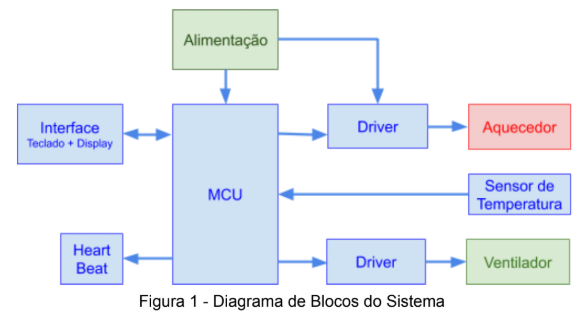

# Controlador de temperatura com controlador proporcional

+ ## Descrição geral do sistema:

  + O sistema de controle de temperatura com controlador proporcional é capaz de resfriar e aquecer o ambiente baseado na temperatura 
atual e na temperatura programada. O controlador é do tipo Proporcional e as saídas para o drive do tipo PWM. Um led de vida do sistema
(Heart Beat), oscila em 0,5Hz sempre que o sistema estiver energizado e o drive estiver habilitado. Caso driver seja desabilitado o Led
permanece aceso.

    + #### Diagrama de blocos do sistema:

<p align="center">
  
</p>

+ ## Interface

  + O bloco de interface contém um display LCD 16x2 e 4 botões. O display apresenta a temperatura atual, a temperatura desejada (set-point) e o estado atual
da saída (aquecendo, resfriando, desabilitado). Os botões são utilizados para alterar os
parâmetros do controlador e o valor de set point.

      + Os botões do teclado servem para ajustar:
        + Um novo set-point.
        + Valor do ganho proporcional do controlador.
        + Desabilitar o controlador (desligar o driver independente do ajuste de
        temperatura)
        + Ligar/Desligar manualmente o aquecedor.
        + Ajustar o valor da saída do aquecedor no modo manual (0...100%).
        + Ligar/Desligar manualmente o ventilador.
        + Ajustar o valor da saída do ventilador no modo manual (0...100%).

<p align="center">
  
</p>


+ ## Funcionamento

  + O sistema se inicializa na tela de monitoramento (tela principal). Nela é possível observar o estado atual do controlador (FAN ON, HEAT ON, DRIVER ON/OFF), o valor atual da temperatura e o setpoint configurado. Ao clicar no botão P, o sistema alterna para a tela de configuração do setpoint, ao pressionar o botão S é possível utilizar os botões UP e DOWN para aumentar ou diminuir, respectivamente, o setpoint, após a configuração é necessário pressionar S de novo para confirmar, podendo então pressionar P novamente para ir para a próxima tela. As telas 3 e 4 configuram o ganho proporcional do controlador de cada um dos atuadores, aquecedor e ventilador, respectivamente. A tela 5 apresenta a opção de Manual Mode, se a opção estiver desligada a tela seguinte será a tela de configuração do status do driver (habilitado ou desabilitado), onde é possível ligá-lo ou desligá-lo, sendo a última tela. Caso o Manual Mode esteja ligado as próximas telas apresentam a configuração manual de aquecimento e resfriamento permitindo ligar um de cada vez e escolher o seu duty cycle, só então é possível ir para a tela de configuração do status do driver.
  
  
+ ## Periféricos

  + **Sensor:** O sensor de temperatura utilizado é o sensor analógico LM35.
  + **MCU:** O MCU utilizado tanto na simulação quanto na montagem prática foi o ATMega328p (Arduino) e ele é o responsável pelas tarefas de controle e interface  do sistema.
  + **Driver:** O driver utilizado é o circuito integrado L293D - Quadruple Half-H Drivers.
  + **Aquecedor:** O aquecimento é realizado com um resistor de 22Ω 1/2W.
  + **Ventilador:** O ventilador é composto por um motor e uma hélice, o modelo utilizado tem as
seguintes características:
       + Alimentação: 12 VDC
       + Corrente: 130mA
  + **Heart Beat:** Um LED foi utilizado para informar que o sistema está em execução. O LED
permanece ligado caso o driver de saída esteja desabilitado. 

+ ## Controlador
  + O controlador utilizado foi do tipo Proporcional, neste controlador o sinal de erro,
diferença entre o sinal de referência e o sinal de realimentação, é multiplicado pelo ganho
proporcional (Kp) e aplicado a saída.

<p align="center">
  
</p>


### And coding style tests

Explain what these tests test and why

```
Give an example
```

## Deployment

Add additional notes about how to deploy this on a live system

## Built With

* [Dropwizard](http://www.dropwizard.io/1.0.2/docs/) - The web framework used
* [Maven](https://maven.apache.org/) - Dependency Management
* [ROME](https://rometools.github.io/rome/) - Used to generate RSS Feeds

## Contributing

Please read [CONTRIBUTING.md](https://gist.github.com/PurpleBooth/b24679402957c63ec426) for details on our code of conduct, and the process for submitting pull requests to us.

## Versioning

We use [SemVer](http://semver.org/) for versioning. For the versions available, see the [tags on this repository](https://github.com/your/project/tags). 

## Authors

* **Billie Thompson** - *Initial work* - [PurpleBooth](https://github.com/PurpleBooth)

See also the list of [contributors](https://github.com/your/project/contributors) who participated in this project.

## License

This project is licensed under the MIT License - see the [LICENSE.md](LICENSE.md) file for details

## Acknowledgments

* Hat tip to anyone whose code was used
* Inspiration
* etc
